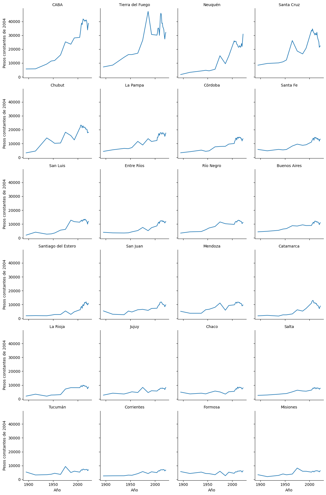

# El producto bruto de las provincias argentinas en el largo plazo. 

Este repositorio contiene el codigo y bases de datos utilizadas para el armado 
de una serie de tiempo de largo plazo (1895 a la actualidad) del producto bruto
geográfico de Argentina. 



## Fuentes de información


*   Araoz et al (2020). Contiene la participación de cada provincia en el PIB para los años 1895,1914,1937,1946,1953,1965,1975,1986,1993 y 2004. 

*   CEPAL et al (2022). Contiene el Valor Agregado Bruto (VAB) a precios básicos por provincias entre los años 2004-2022

*   Fundación Norte y Sur. Contiene el PIB a precios de mercado entre 1810 y 2018

*   INDEC. Contiene asdasdasdasd


## Metodología

La serie de tiempo consiste en un empalme de series utilizando el año 2004 como año de empalme.... 


## Código 

El código de Python en este repositorio contiene un programa que puede correrse por línea de comando. 


```
python run.py  # genera/actualiza empalme y guarda en la carpeta "./tables"
python run.py --generar-tablas # guarda las tablas limpias en la carpeta "./tables/"

```


O se puede ejecutar dentro de una notebook de Python. 

```python

from run import main

PATHS = {
    'path_araoz': "input_data/araoz_nicolini_et_al.csv",
    'path_cepal': "https://repositorio.cepal.org/server/api/core/bitstreams/7399c6c9-0827-42da-b433-d176cb4107c7/content",
    'path_fnys': "https://docs.google.com/spreadsheets/d/e/2PACX-1vTAGGfIqDw18YDI5zasGBRa4sG1ddUfMcKT87fzTkvz8HMe8Ipl6zJU0M2788oZrw/pub?output=xls"
}

empalme_df = main(**PATHS)

```
<div>
<style scoped>
    .dataframe tbody tr th:only-of-type {
        vertical-align: middle;
    }

    .dataframe tbody tr th {
        vertical-align: top;
    }

    .dataframe thead th {
        text-align: right;
    }
</style>
<table border="1" class="dataframe">
  <thead>
    <tr style="text-align: right;">
      <th></th>
      <th>provincia</th>
      <th>anio</th>
      <th>vab_pb</th>
    </tr>
  </thead>
  <tbody>
    <tr>
      <th>0</th>
      <td>Buenos Aires</td>
      <td>1895</td>
      <td>4158.050900</td>
    </tr>
    <tr>
      <th>1</th>
      <td>CABA</td>
      <td>1895</td>
      <td>3899.104045</td>
    </tr>
    <tr>
      <th>2</th>
      <td>Catamarca</td>
      <td>1895</td>
      <td>174.232343</td>
    </tr>
    <tr>
      <th>3</th>
      <td>Chaco</td>
      <td>1895</td>
      <td>52.668648</td>
    </tr>
    <tr>
      <th>4</th>
      <td>Chubut</td>
      <td>1895</td>
      <td>12.641585</td>
    </tr>
    <tr>
      <th>...</th>
      <td>...</td>
      <td>...</td>
      <td>...</td>
    </tr>
    <tr>
      <th>686</th>
      <td>Tucumán</td>
      <td>2018</td>
      <td>11948.695281</td>
    </tr>
    <tr>
      <th>687</th>
      <td>Tucumán</td>
      <td>2019</td>
      <td>12048.029232</td>
    </tr>
    <tr>
      <th>688</th>
      <td>Tucumán</td>
      <td>2020</td>
      <td>10852.160282</td>
    </tr>
    <tr>
      <th>689</th>
      <td>Tucumán</td>
      <td>2021</td>
      <td>11862.031244</td>
    </tr>
    <tr>
      <th>690</th>
      <td>Tucumán</td>
      <td>2022</td>
      <td>11856.808241</td>
    </tr>
  </tbody>
</table>
<p>691 rows × 3 columns</p>
</div>


<div>
<a href="https://fund.ar">
  <picture>
    <source media="(prefers-color-scheme: dark)" srcset="https://github.com/datos-Fundar/fundartools/assets/86327859/6ef27bf9-141f-4537-9d78-e16b80196959">
    <source media="(prefers-color-scheme: light)" srcset="https://github.com/datos-Fundar/fundartools/assets/86327859/aa8e7c72-4fad-403a-a8b9-739724b4c533">
    </img>
  </picture>
</a>
</div>